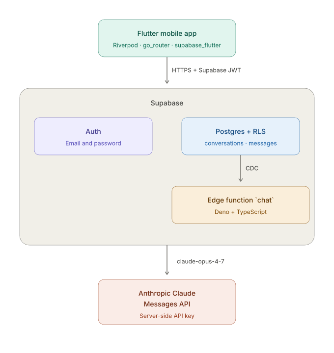
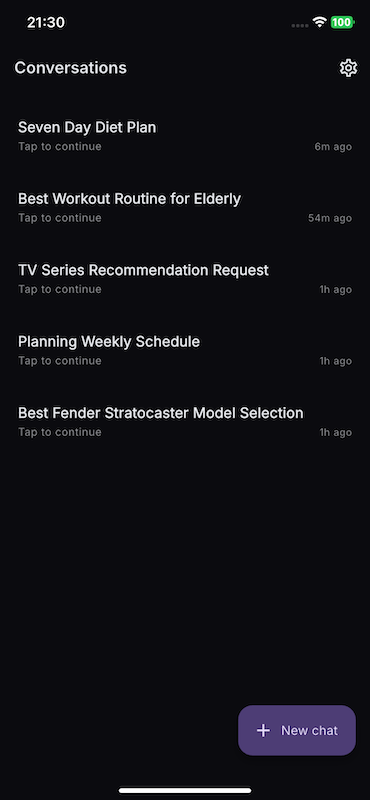
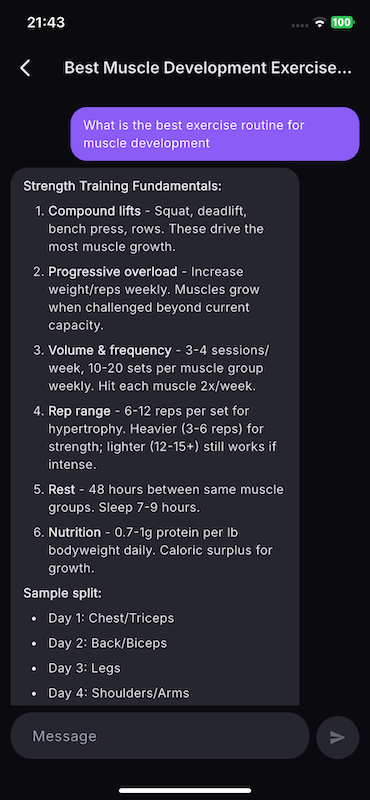
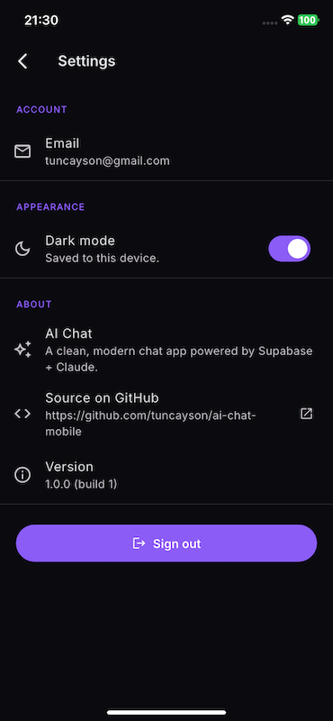
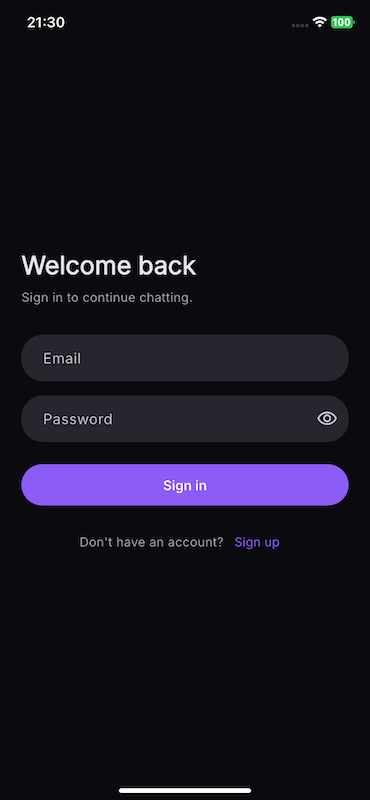
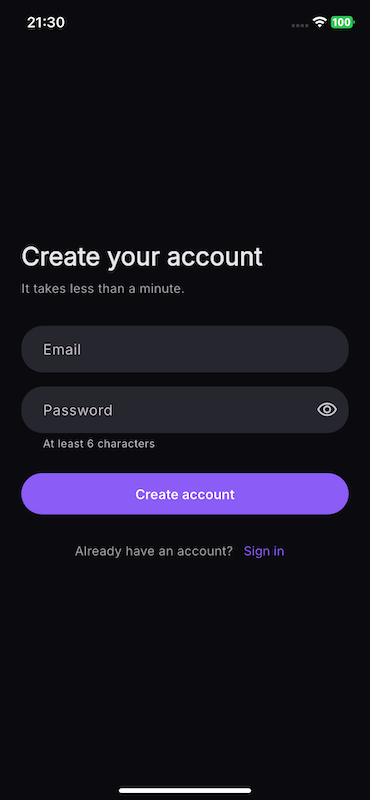
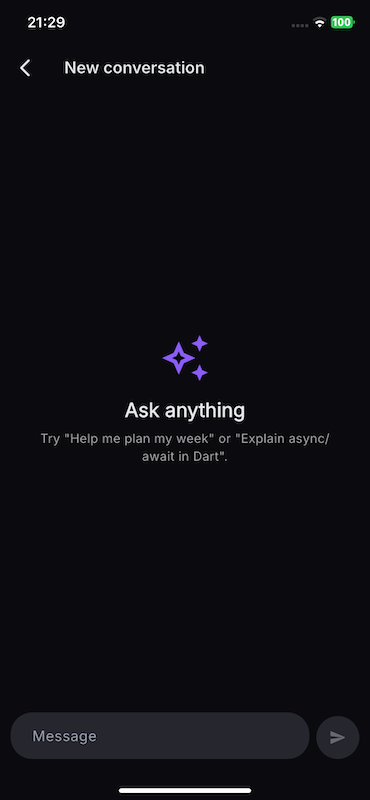

# ai-chat-mobile

A cross-platform Flutter chat app (Android + iOS) where a signed-in user has memory-aware conversations with an Anthropic Claude assistant. The backend is **entirely Supabase** — Auth, Postgres with Row Level Security, and a single Edge Function that proxies the Claude API. No separate Node service, no API key in the mobile binary.

## Architecture



The Anthropic API key lives **only** inside the Edge Function's secrets — never in the mobile binary. The app ships only Supabase's publishable (anon) key; Row Level Security is what protects the data.

See [`Architecture.md`](./Architecture.md) for the deeper technical contract: schema, policies, conventions, what NOT to do.

## 📱 Screenshots

<p align="center">
  
  
  
</p>

<p align="center">
  
  
  
</p>

## Screens

| Screen | Notes |
| --- | --- |
| `Login` / `Signup` | Email + password forms, in-button spinner, themed SnackBar errors, autofill hints. |
| `Conversations` | Realtime list via Supabase `.stream()`, pull-to-refresh, FAB to start a new chat, long-press → bottom sheet → delete confirmation. Empty state. |
| `Chat` | Realtime message stream, markdown-rendered assistant replies, optimistic pending bubble with timestamp-based dedupe, animated typing indicator, `Cmd`/`Ctrl`+`Enter` to send, keyboard dismiss on send. |
| `Settings` | Account email, persisted dark-mode toggle, app version (`package_info_plus`), GitHub link (`url_launcher`), sign-out with confirmation. |

## Stack

| Layer | Choice |
| --- | --- |
| UI | Flutter 3.x, Material 3 dark-first theming via `google_fonts` (Inter) |
| State | `flutter_riverpod` + `riverpod_generator` (`@riverpod` codegen) |
| Routing | `go_router` with an auth-aware `refreshListenable` |
| Client SDK | `supabase_flutter` (Auth + Postgres + Realtime + Functions) |
| Markdown | `flutter_markdown` with selectable code blocks |
| Local prefs | `shared_preferences` (dark-mode persistence) |
| Backend | Supabase (Postgres, Auth, Edge Functions, Realtime) |
| Edge runtime | Deno + TypeScript, `@supabase/supabase-js@2` |
| LLM | Anthropic Claude Messages API (`claude-opus-4-7` by default) |
| Lints | `very_good_analysis` + `riverpod_lint` |

## Local development

You need:

- Flutter SDK 3.x (stable channel)
- A Supabase project (free tier is fine)
- The Supabase CLI (`brew install supabase/tap/supabase`)
- An Anthropic API key

```sh
git clone https://github.com/tuncayson/ai-chat-mobile.git
cd ai-chat-mobile
flutter pub get
dart run build_runner build   # generate the Riverpod *.g.dart files
```

### 1. Apply the database migrations

```sh
supabase link --project-ref <your-project-ref>
supabase db push
```

The three migrations land in order:

| File | Adds |
| --- | --- |
| `001_initial_schema.sql` | `conversations` + `messages` tables, indexes, RLS policies (one per operation), `updated_at` triggers. |
| `002_default_user_id_and_realtime.sql` | `default auth.uid()` on `conversations.user_id`; adds `conversations` to the `supabase_realtime` publication. |
| `003_realtime_messages.sql` | Adds `messages` to the `supabase_realtime` publication. |

If you prefer the dashboard, paste each file into the SQL Editor and run it in order.

### 2. Deploy the Edge Function

```sh
supabase secrets set ANTHROPIC_API_KEY=sk-ant-...
supabase functions deploy chat
```

Optional tuning secrets — re-read on every request, so changes take effect with **no redeploy**:

| Secret | Default | Notes |
| --- | --- | --- |
| `CLAUDE_MODEL` | `claude-opus-4-7` | Any current Anthropic model id (e.g. `claude-sonnet-4-6`, `claude-haiku-4-5-20251001`). |
| `CLAUDE_SYSTEM_PROMPT` | built-in chat prompt | Free-form text; mind shell quoting. |
| `CLAUDE_MAX_TOKENS` | `1024` | Positive integer; invalid values silently fall back. |
| `CLAUDE_TEMPERATURE` | `0.7` | Float; clamped to `[0, 1]`. |

### 3. Run the app

```sh
flutter run \
  --dart-define=SUPABASE_URL=https://<project>.supabase.co \
  --dart-define=SUPABASE_ANON_KEY=<anon-key>
```

The anon key is publishable — it's expected to ship in the mobile binary. RLS is what protects the data.

Useful day-to-day commands:

```sh
flutter analyze
flutter test
dart format .
dart run build_runner build       # regenerate Riverpod code after editing annotations
dart run build_runner watch       # auto-regen during development
```

## How a message round-trip works

1. User types in `ChatInput` and taps send. An optimistic "pending" bubble appears immediately.
2. `ChatRepository.sendMessage` calls `supabase.functions.invoke('chat', …)` carrying the user's JWT.
3. The Edge Function:
   - Builds a Supabase client under the caller's JWT, so every DB call is RLS-filtered.
   - Verifies the conversation belongs to the caller (`maybeSingle()` returns nothing if RLS hides it → `404`).
   - Persists the user message.
   - Loads the last 20 messages and POSTs them to Anthropic's `/v1/messages`.
   - Persists the assistant reply.
   - On the first turn, fires a second tiny Claude call to generate a short title and updates `conversations.title` — wrapped in `try/catch` so a failure here never breaks the main response.
4. Realtime CDC events for both message inserts (and the title `UPDATE`) flow back to every subscribed client via `messages_repository.watch()` and `conversations_list_provider`. The UI swaps the optimistic bubble for the real row, dismisses the typing indicator, and re-sorts the conversations list.

## Security

- **Anthropic API key** lives only in the Edge Function's `ANTHROPIC_API_KEY` secret. Never logged, never returned in responses; on upstream failure the function returns a generic `502` with details only in server logs.
- **Row Level Security** is enabled on every table. `conversations` is scoped by `auth.uid() = user_id`; `messages` is scoped by ownership of the parent conversation. Clients never send `user_id` filters or payloads — RLS is the only source of truth.
- The Edge Function does **not** use the service-role key; all DB writes go through the caller's JWT so RLS applies even server-side.
- Log statements in the Edge Function never include full message content.

## Future work

- **Streaming responses.** The current function is non-streaming. SSE from Anthropic → SSE from the Edge Function → an incremental stream into the chat screen is the natural next step.
- **Voice input** via Whisper or device-native STT.
- **Image attachments** (Claude vision).
- **Per-conversation system prompts** for distinct personas.
- **Export conversation as Markdown** from the chat AppBar overflow menu.
- **Multi-device sync indicator** so the user can tell when a message they sent from one device is mirrored to another.
- **Push notifications** for long-running responses (relevant once streaming lands).
